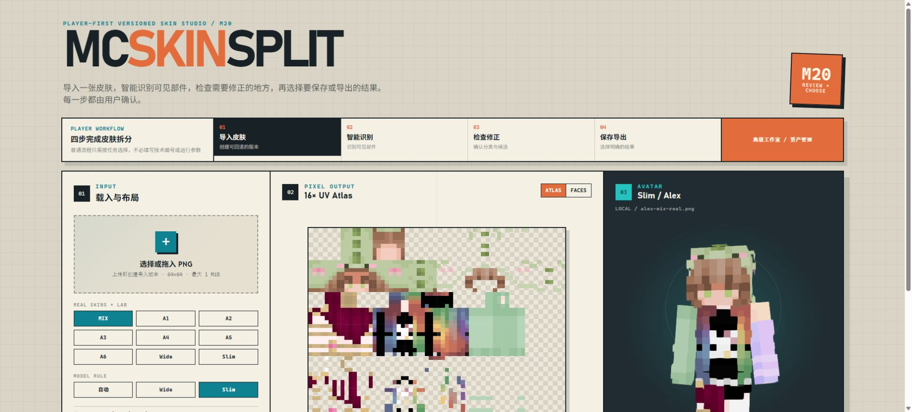
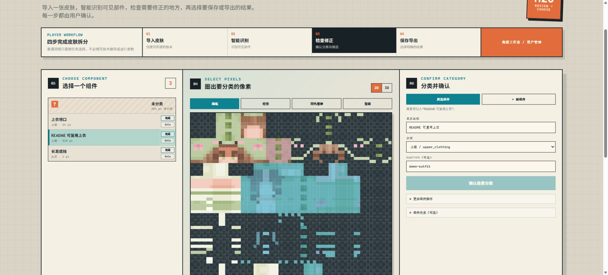
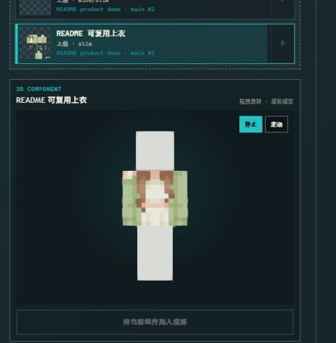

# MCSkinSplit

> 把一张 Minecraft 皮肤拆成可理解、可修正、可复用的语义组件，并保留每一次操作的版本与像素来源。

[中文说明](#中文说明) · [English](#english)

## 中文说明

### 从整张皮肤到可复用组件

MCSkinSplit 是一套面向 Minecraft 皮肤创作者、像素美术和资源整理者的本地工作台。它不会把皮肤粗略切成头、身体和四肢图片，而是把跨 UV 面、跨身体部位和跨 Base/Outer 图层的像素组织成“长发”“上衣”“手套”“鞋子”“头饰”等真正可使用的语义组件。

普通玩家只需完成四步：**导入皮肤 → 智能识别 → 检查修正 → 保存导出**。历史版本、组件修补、多皮肤混搭和资产管理仍可从高级工作室进入。完整产品定位、第一版边界与待验证问题见 [PRODUCT.md](PRODUCT.md)。



### 核心功能

- **真实皮肤工作台：** 无损读取 64×64 RGBA PNG，识别 Slim/Alex 与 Wide/Classic 手臂布局，并联动显示像素级 Atlas 和 3D 角色。
- **语义组件拆分：** 用精确像素遮罩表示头发、服装、肤色、五官和饰品；一个组件可以跨多个身体面，同一面也可以包含多个组件。
- **玩家可控修正：** 在组件树、2D/3D 视图和分类面板之间检查结果，支持画笔、矩形、同色魔棒、整面选择、Unknown、合并、拆分、重分类、关系编辑和草稿撤销/重做。
- **不可变版本与来源：** 导入、AI 分类、人工修正、部件应用、修补和混搭都创建新 Revision；旧结果不被覆盖，逐像素来源可以区分源图、人工创作和已接受的生成内容。
- **可复用资产：** 组件可以保存为带纹理、写入遮罩、来源和预览的 Part；完整头发、服装或饰品分类可以保存为 Bundle。
- **安全修补与混搭：** 在应用组件或组合多张皮肤前显示模型、图层、语义边界和逐像素冲突，再由用户选择处理方式。
- **可选 AI：** AI 只负责初始分类或对 Host 已生成的候选 ID 排序；Schema、像素归属、范围、Hash 和来源始终由本地 Host 校验。

### 怎么使用



图表由 Kroki 从可维护的 [Mermaid 源码](docs/assets/readme/user-workflow.mmd)生成。

1. 导入一张 64×64 PNG，并确认 Slim 或 Wide 手臂布局。
2. 启动可选智能识别，或直接使用人工拆分工具。
3. 选择组件，在 2D/3D 中检查像素归属；草稿只有在确认后才创建新版本。
4. 选择明确的结果，下载完整皮肤 PNG，或保存单个 Part、完整分类 Bundle。

### 真实界面

| 组件检查与逐像素修正 | 拆分后的可复用组件 |
| --- | --- |
|  |  |

左侧界面展示组件树、像素选择和分类确认；右侧展示从皮肤中导出的独立 Part，以及它在对应 Slim/Wide 模型上的真实外观。图片来自本仓库运行中的实际界面，不是概念稿。

### 怎么运作



图表由 Kroki 从可维护的 [Mermaid 源码](docs/assets/readme/system-workflow.mmd)生成。

关键原则是：**模型没有直接写入皮肤或版本历史的权限**。本地 Host 负责 PNG 解码、UV 映射、候选区域、像素边界和来源证据；可选 AI 只能返回受 Schema 约束的分类或候选排序。结果通过严格校验并由用户确认后，系统才会创建带 Branch、快照 Hash 和逐像素 Origin 的不可变 Revision。

### 快速开始

要求：

- Node.js 24
- pnpm 10.13.1
- 支持 WebGL 的浏览器
- 可选 AI 功能需要已经安装并完成认证的 Codex CLI

```bash
pnpm install
pnpm fixtures:generate
pnpm dev
```

打开 `http://127.0.0.1:5173`。该命令会同时启动 Fastify API（`127.0.0.1:3001`）和 Vite。运行时数据库、Revision 快照、部件和审计资料默认保存在 `data/`；启动 API 前设置 `MC_SKIN_DATA_DIR` 可以改用其他数据目录。

隐藏内容 Completion 是实验功能，默认不会进入玩家流程。只在明确测试时设置 `VITE_ENABLE_COMPLETION_WORKSPACE=true`；它生成的是需要人工审核的推测候选，不会宣称恢复了原作者没有画出的真实像素。

### 验证

```bash
pnpm verify
```

该命令检查 fixture 是否漂移，运行所有 TypeScript 类型检查和单元/集成测试，并构建全部 workspace 包。

确定性浏览器回归使用隔离数据目录和 replay provider，不依赖外部模型：

```bash
pnpm browser:install
pnpm verify:browser
```

### 当前边界

- AI 完全可选；PNG/UV、人工拆分、版本、预览、Part、Bundle、修补和混搭都可以在没有模型调用时工作。
- Completion 生成的是推测内容，始终需要显式接受；评测与发布门未全部通过前保持 feature flag 默认关闭。
- 同层隐藏内容可以形成未发布的 latent Part，但不能伪装成来源皮肤中的单层 PNG。
- 仓库没有承诺云部署、多人实时协作、在线素材市场或自动发布资产。

### 文档导航

- [产品说明与第一版范围](PRODUCT.md)
- [架构与数据流](docs/architecture.md)
- [UV 布局合同](docs/uv-layout.md)
- [版本历史与存储](docs/revision-history.md)
- [语义编辑与组件](docs/semantic-editing-and-parts.md)
- [AI 分析合同](docs/ai-analysis.md)
- [组件修补](docs/component-repair-workflow.md)
- [多组件混搭](docs/composition-workflow.md)
- [隐藏内容候选](docs/hidden-content-completion.md)
- [实现状态与验证证据](docs/implementation-status.md)

### 仓库结构

```text
apps/api/                     Fastify Project / Revision API
apps/ai-worker/               持久化 AI Job、Run 与审计资料
apps/web/                     Vite + React 浏览器工作台
packages/ai-provider/         可替换 Provider 合同与 Codex CLI 适配器
packages/skin-analysis-pack/  确定性分析工作区、证据与离线评测
packages/skin-compositor/     多组件混搭与冲突报告
packages/skin-core/           PNG、布局、UV、语义与渲染核心
packages/skin-revision/       SQLite 元数据与不可变快照服务
docs/                         产品、架构、工作流和验证文档
tests/e2e/                    确定性浏览器回归
```

## English

### From a full skin to reusable semantic components

MCSkinSplit is a local, versioned studio for Minecraft skin creators, pixel artists, and asset curators. It turns exact source pixels into meaningful components such as hair, clothing, gloves, shoes, and accessories instead of treating a body part or UV face as the final asset.

The ordinary-player workflow is deliberately short: **Import → Smart analysis → Check & correct → Save & export**. Revision history, component repair, multi-skin composition, and asset management remain available in the Advanced Studio. See [PRODUCT.md](PRODUCT.md) for the product direction, first-release scope, and open validation questions.

The screenshots in the [real interface section](#真实界面) come from the running application and show the player workspace, pixel-accurate semantic editor, and an exported reusable Part.

### What it does

- Decodes lossless 64×64 RGBA skins and keeps Slim/Alex and Wide/Classic UV layouts explicit.
- Links a nearest-neighbor Atlas, semantic component masks, and a Revision-aware 3D avatar.
- Supports pixel-level assignment, Unknown, merge, split, reclassification, relations, local undo/redo, and 2D/3D inspection.
- Stores every confirmed change as an immutable Revision with Branch history and per-pixel origin evidence.
- Exports verified reusable Parts and complete-category Bundles, then reports conflicts before repair or composition.
- Uses AI only as an optional classifier or ranker over host-owned evidence and candidate IDs; the host remains authoritative for pixels, validation, hashes, and persistence.

### User workflow


[Mermaid source](docs/assets/readme/user-workflow.mmd), rendered through Kroki.

### How it works


[Mermaid source](docs/assets/readme/system-workflow.mmd), rendered through Kroki.

The model never receives direct write authority. The deterministic host decodes the PNG, maps UV surfaces, builds candidate evidence, validates every returned identity and pixel boundary, and waits for explicit user confirmation before creating an immutable Revision.

### Quick start

Requirements: Node.js 24, pnpm 10.13.1, and a WebGL-capable browser. Optional AI workflows additionally require an installed and authenticated Codex CLI.

```bash
pnpm install
pnpm fixtures:generate
pnpm dev
```

Open `http://127.0.0.1:5173`; the Fastify API listens on `127.0.0.1:3001`. Runtime data is stored under `data/` by default. Set `MC_SKIN_DATA_DIR` before starting the API to use a different data directory.

### Verification

```bash
pnpm verify

# Deterministic Chromium E2E with isolated data and a replay provider
pnpm browser:install
pnpm verify:browser
```

### Current boundaries

- AI is optional; deterministic editing, history, previews, Parts, Bundles, repair, and composition work without a model call.
- Hidden-content Completion is inference, not factual recovery. It stays behind `VITE_ENABLE_COMPLETION_WORKSPACE=true` until its release evidence is complete and always requires an explicit decision.
- A same-layer latent completion may become an unpublished Part, but it cannot be represented honestly as pixels from the original single-layer skin PNG.
- Cloud deployment, real-time collaboration, an online marketplace, and automatic asset publication are not claimed by this repository.

For detailed contracts and evidence, start with [architecture](docs/architecture.md), [AI analysis](docs/ai-analysis.md), [hidden-content completion](docs/hidden-content-completion.md), and [implementation status](docs/implementation-status.md).
