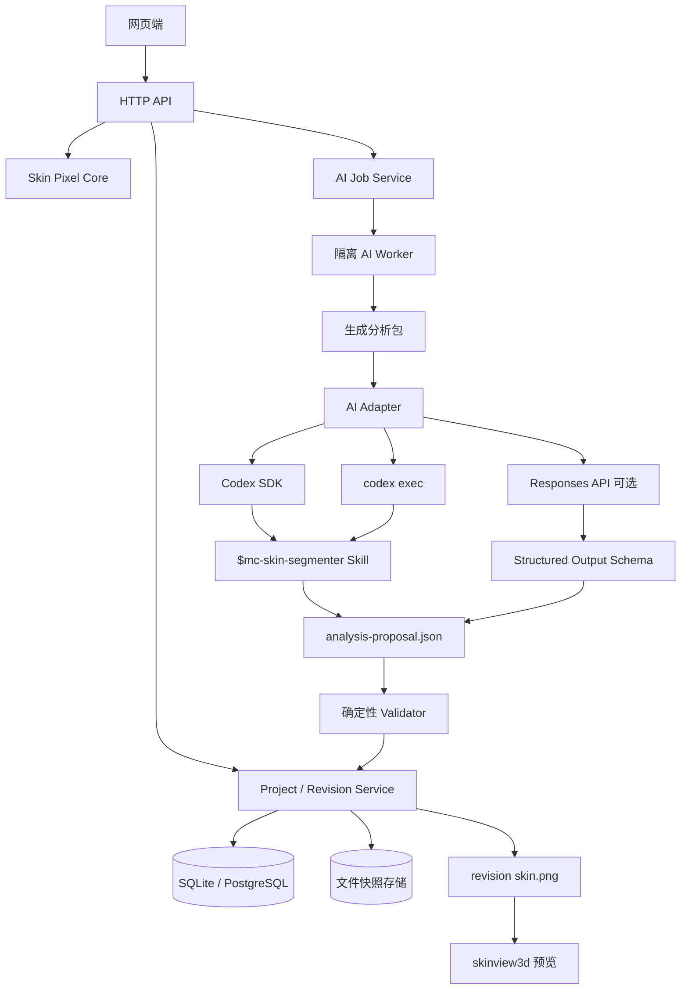
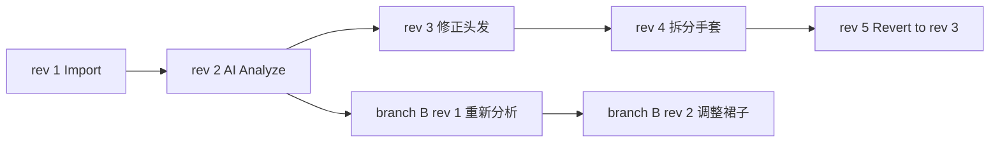
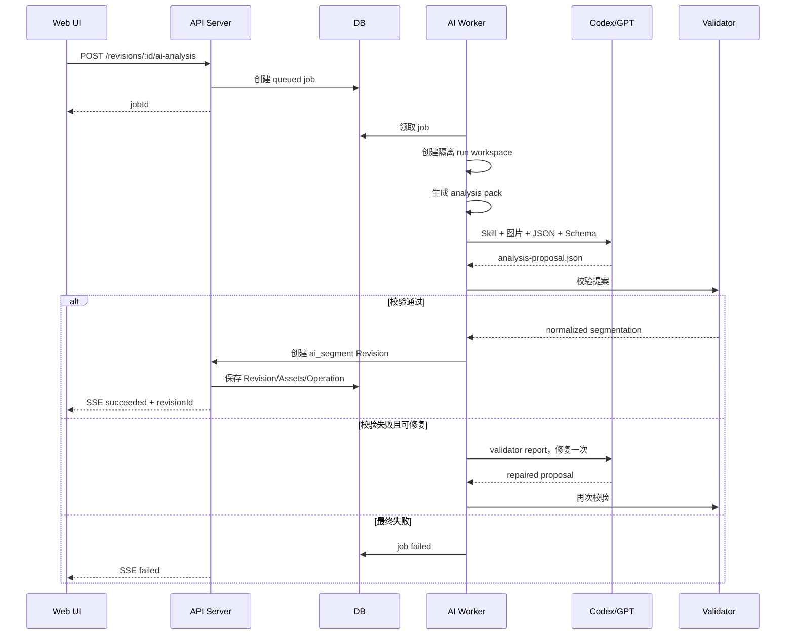

# Minecraft 皮肤 AI 辅助语义拆分、部件库与版本化编辑器实现方案

> 面向 Codex 的实现规格草案  
> 文档日期：2026-08-11  
> 目标：在**不训练新 AI 模型**的前提下，引入现有 GPT/Codex 能力，通过 Skill、确定性像素工具和结构化输出，辅助识别并拆分 Minecraft 皮肤中的头发、服装、装饰、手套、鞋、肤色、五官等部件；所有操作形成不可变版本，可随时回退、分支并从任意历史节点继续。

---

## 0. 给 Codex 的执行摘要

本项目不是通用图像抠图项目，也不是从零训练语义分割模型。

核心实现应拆为三层：

1. **确定性像素核心**
   - 严格读取 64×64 PNG 原始像素。
   - 按 Minecraft 固定 UV 拓扑，将每个像素映射到头、身体、双臂、双腿、六个面以及 Base/Outer 层。
   - 负责像素坐标、遮罩、复制、合成、冲突校验、导出，任何时候都不能依赖 AI 猜坐标。

2. **既有 AI 的语义判断层**
   - 通过 Codex SDK、`codex exec` 或 OpenAI Responses API 调用现有 GPT-5.6 类模型。
   - AI 读取预先生成的分析包，判断哪些候选像素区域属于头发、眼睛、衣服、鞋子等。
   - AI 只输出符合 JSON Schema 的“分类提案”和少量像素修正规则，不直接写数据库，也不直接覆盖源 PNG。

3. **不可变版本与部件复用层**
   - 每次确认操作都生成新的 Revision 快照。
   - 每个 Revision 保存完整皮肤 PNG、语义拆分 JSON、组件遮罩、操作说明和校验哈希。
   - 历史版本不允许原地修改；从旧版本继续编辑时创建新分支或新子版本。
   - 被拆出的部件保存为完整 64×64 透明纹理 + 64×64 写入遮罩 + 元数据，后续按原坐标无损复写到新皮肤。

### 第一版必须完成

- 64×64 Classic / Slim 皮肤导入。
- 固定 UV 解析和像素级无损往返导出。
- `skinview3d.bundle.js` 三维预览。
- 人工分类和 AI 辅助分类。
- Revision 时间线、回退、从旧版本分支。
- 部件保存、重新应用、冲突提示。
- SQLite + 文件快照存储。
- 仓库内 `.agents/skills/mc-skin-segmenter/` Skill。

### 第一版明确不做

- 不训练 U-Net、SAM 或自研视觉模型。
- 不追求全自动且百分之百正确。
- 不让模型直接生成修改后的 PNG。
- 不先做账号、社区、素材市场和云同步。
- 不先支持任意图片、人物照片或非 Minecraft UV 图。
- 不先支持 128×128 HD、旧版 64×32 和非标准模型。

---

# 1. 产品定义

## 1.1 一句话定义

这是一个：

> **基于固定 Minecraft UV 坐标的、AI 辅助语义标注、像素部件拆分、不可变版本管理与无损重组网页工具。**

它不是普通的“上传图片后 AI 抠图”。

Minecraft 皮肤虽然表现为一张 64×64 PNG，但每个位置具有固定含义。例如某块像素必然属于：

- 头部正面基础层；
- 头部背面外层；
- 左臂外侧基础层；
- 右腿底面外层；
- 或完全未使用的透明区域。

因此，系统应先把 PNG 转成固定的表面坐标，再让 AI 判断这些表面上的像素“看起来是什么”。

---

## 1.2 用户主要流程


---

## 1.3 预期识别内容

### 身份与身体基础

- 肤色基础；
- 肤色主色、高光、阴影、腮红色；
- 面部整体；
- 左眼、右眼；
- 眉毛；
- 嘴；
- 腮红；
- 伤痕、面纹或抽象表情；
- 其他无法精确命名的面部细节。

### 头发

- 完整发型；
- 刘海；
- 侧发；
- 后发；
- 长发；
- 发尾；
- 头发外层；
- 被归入身体背面或手臂区域的长发像素。

### 服装

- 内搭上衣；
- 外套；
- 连衣裙或连体服；
- 裤子；
- 裙子；
- 袖子；
- 袖口；
- 手套；
- 袜子或腿部服饰；
- 鞋、靴子；
- 领口、围巾、领结、领带；
- 腰带、腰封。

### 装饰

- 帽子、兜帽、王冠；
- 猫耳、兔耳、角、光环；
- 发夹、发带、蝴蝶结、花朵；
- 眼镜、眼罩、口罩；
- 项链、胸针、徽章；
- 背包、翅膀图案、背部装饰；
- 手环、臂章、腿环；
- 尾巴或其他抽象附件；
- 未知装饰。

---

# 2. 关键设计结论

## 2.1 AI 不负责“像素工程”

AI 适合判断：

- 这块红色区域更像头发还是兜帽；
- 腿部底端是鞋子还是袜子；
- 身体与双腿上的连续图案是否属于同一件连衣裙；
- 头部外层是否是发饰；
- 面部的少量浅色像素是否是眼睛高光。

AI 不应负责：

- 直接决定 PNG 如何编码；
- 直接修改源文件；
- 自由缩放、重绘或重新生成皮肤；
- 不经校验地给数据库写入大量坐标；
- 将推测补全伪装成原始像素。

所有真实写入操作由固定脚本完成。

---

## 2.2 模型输出“语义提案”，程序输出“精确遮罩”

推荐先由程序生成候选区域，再让 AI 对候选区域归类。

例如：

```json
{
  "candidateRegionId": "region_head_outer_013",
  "surfaces": ["head.outer.front", "head.outer.left"],
  "colors": ["#8E1129", "#B8263C", "#5D0A1B"],
  "pixelCount": 21,
  "atlasSpans": [
    { "y": 1, "x0": 40, "x1": 44 },
    { "y": 2, "x0": 39, "x1": 45 }
  ]
}
```

AI 返回：

```json
{
  "candidateRegionIds": ["region_head_outer_013"],
  "category": "hair",
  "subtype": "bangs",
  "instanceId": "hair.main",
  "confidence": 0.91
}
```

之后由程序根据 `candidateRegionId` 生成精确 64×64 遮罩。

只有候选区域无法表达时，AI 才允许输出少量 `pixelOverrides`，并且仍需经过坐标和冲突校验。

---

## 2.3 完整快照优先于复杂增量存储

单张标准皮肤只有 64×64，即 4096 个像素。即使每个版本保存：

- 完整 PNG；
- 完整拆分 JSON；
- 若干部件遮罩；
- 一张缩略图；

占用也很小。

因此 MVP 不需要先实现复杂的二进制增量算法。推荐采用：

> **不可变操作日志 + 每个 Revision 完整快照。**

这样更容易：

- 回退；
- 从旧版本重新开始；
- 对比两个版本；
- 排查 AI 错误；
- 导出任意历史结果；
- 防止历史数据因结构升级而损坏。

后续可以按哈希做内容去重，但不改变逻辑模型。

---

# 3. 总体架构



---

# 4. 推荐技术栈

## 4.1 优先适配现有项目

Codex 开始实现前必须先识别当前项目技术栈。

- 如果当前页面是原生 HTML/CSS/JavaScript，不要为了本功能强制迁移到 Next.js。
- 如果当前项目已使用 Vite、React、Vue 或其他框架，应在现有框架内实现。
- 像素核心、Revision 服务和 AI Adapter 应独立成模块，不与某个 UI 框架强绑定。

## 4.2 推荐默认栈

| 层 | 推荐实现 |
|---|---|
| 前端 | 现有页面或 Vite + TypeScript |
| 3D 预览 | 本地 `skinview3d.bundle.js` |
| 2D 像素编辑 | Canvas 2D，关闭平滑 |
| 后端 | Node.js 18+、TypeScript、Fastify 或 Express |
| PNG 处理 | `pngjs`；需要缩略图时可额外使用 `sharp`，必须指定 nearest-neighbor |
| 数据库 | SQLite，MVP 可用 `better-sqlite3`；结构稳定后可迁移 PostgreSQL |
| 文件存储 | 本地文件目录；以后可换 S3/MinIO |
| AI | `@openai/codex-sdk`、`codex exec`，或 Responses API Adapter |
| Schema | JSON Schema + Zod/Ajv 校验 |
| 测试 | Vitest/Jest + Playwright |

## 4.3 AI Provider 抽象

不要把项目写死为一种调用方式。

```ts
export interface SkinSemanticAiProvider {
  readonly providerName: string;

  analyze(input: AnalysisJobInput): Promise<AnalysisProposal>;
  review?(input: ReviewJobInput): Promise<ReviewProposal>;
}
```

实现三个 Adapter：

```text
CodexSdkProvider       本地原型首选
CodexExecProvider      CLI/脚本回退方案
ResponsesVisionProvider 部署型服务或视觉能力回退方案
```

环境配置示例：

```env
AI_PROVIDER=codex-sdk
AI_MODEL=gpt-5.6
AI_TIMEOUT_SECONDS=300
AI_MAX_REPAIR_ATTEMPTS=1
AI_KEEP_RUN_WORKSPACE=true
```

`AI_MODEL` 必须是配置项，不要在多处代码中硬编码。

---

# 5. Codex 与现有 AI 的接入方式

## 5.1 推荐优先级

### 方案 A：Codex SDK，MVP 首选

适合：

- 本地运行；
- 个人工具；
- 需要 Codex 读取仓库内 Skill、脚本和参考资料；
- 需要继续或恢复线程；
- 希望 AI 能调用确定性工具进行反复检查。

后端通过 `@openai/codex-sdk` 启动隔离线程。AI 的工作目录限定到单次分析任务目录。

注意：

- Codex 线程不是数据真相来源。
- 即使线程可以恢复，下一次分析仍要显式提供当前 Revision 的完整分析包。
- 数据库和快照文件才是权威状态。

### 方案 B：`codex exec`，脚本化回退

适合：

- 快速验证 Skill；
- CI 或本地任务队列；
- 希望直接使用 JSON Schema 约束最终输出。

示意命令：

```bash
codex exec \
  --sandbox workspace-write \
  --output-schema ./schemas/analysis-proposal.schema.json \
  -o ./runs/$RUN_ID/output/analysis-proposal.json \
  "Use $mc-skin-segmenter to analyze the job in ./runs/$RUN_ID/job.json. Do not modify source files."
```

需要运行过程事件时：

```bash
codex exec --json "Use $mc-skin-segmenter to analyze this job" \
  > ./runs/$RUN_ID/codex-events.jsonl
```

### 方案 C：Responses API，部署型补充

适合：

- 网页工具部署到服务器；
- 不希望服务器长期维持本地 Codex 环境；
- 需要稳定的图片输入与结构化输出；
- 希望横向扩容。

这一方案仍然不是训练模型，而是调用现有视觉模型。

Skill 中的规则、分类法和输出 Schema 可以转成服务端提示模板继续复用。

---

## 5.2 AI 可用性探针

Codex 实现 AI Worker 前，先建立一个最小探针：

1. 在任务目录放入一张 64×64 皮肤和一张 1024×1024 nearest-neighbor 放大图。
2. 让当前 Codex 运行环境回答一个简单问题，例如“头发主色是什么，鞋子大致位于哪些身体区域”。
3. 验证是否能稳定读取本地 PNG。
4. 若当前 SDK/CLI 环境不能可靠读取图片：
   - Codex 仍负责工作流和工具调用；
   - 图片语义分析改由 `ResponsesVisionProvider` 完成；
   - 两种 Provider 返回同一 `AnalysisProposal` Schema。

不要在尚未做探针时假设任意运行环境都能以相同方式读取图片。

---

# 6. AI 分析包

AI 不应只接收原始 64×64 PNG。1 像素细节过小，而且 UV 平铺图不直观。

每次分析任务应生成如下目录：

```text
runs/<run-id>/
├── job.json
├── input/
│   ├── source.png
│   ├── atlas-16x.png
│   ├── atlas-grid-16x.png
│   ├── face-contact-sheet.png
│   ├── views/
│   │   ├── front.png
│   │   ├── back.png
│   │   ├── left.png
│   │   ├── right.png
│   │   └── isometric.png
│   ├── pixel-map.json
│   ├── palette.json
│   ├── candidate-regions.json
│   └── previous-segmentation.json
├── schema/
│   └── analysis-proposal.schema.json
├── output/
│   └── analysis-proposal.json
└── logs/
    ├── codex-events.jsonl
    └── validator-report.json
```

## 6.1 文件说明

### `source.png`

原始或当前 Revision 的 64×64 PNG，不得修改。

### `atlas-16x.png`

使用最近邻放大到 1024×1024，不能做线性插值。

### `atlas-grid-16x.png`

仅供 AI 和人工检查的辅助图，可标记：

- UV 区域边框；
- Body Part；
- Face；
- Base/Outer；
- 坐标刻度。

它不是导出资源。

### `face-contact-sheet.png`

按语义顺序排列各身体表面，而不是按原 PNG Atlas 顺序排列，例如：

```text
Head Base: front / back / left / right / top / bottom
Head Outer: ...
Torso Base: ...
...
```

### `views/*.png`

可通过两种方式实现：

1. 使用 `skinview3d` + Playwright 进行无界面截图；
2. MVP 先生成正面/背面展开图，后续再补三维截图。

### `pixel-map.json`

记录每个有效像素的固定语义坐标。

```json
{
  "atlasWidth": 64,
  "atlasHeight": 64,
  "coordinateOrigin": "top-left",
  "items": [
    {
      "pixelId": 520,
      "atlasX": 8,
      "atlasY": 8,
      "rgba": [143, 37, 49, 255],
      "surface": "head.base.front",
      "bodyPart": "head",
      "face": "front",
      "layer": "base",
      "localU": 0,
      "localV": 0
    }
  ]
}
```

### `candidate-regions.json`

由确定性算法生成的候选像素块。可结合：

- 固定表面边界；
- 完全相同颜色的连通区域；
- 近似颜色连通区域；
- UV 接缝邻接；
- 左右对称；
- Base/Outer 关系；
- 颜色调色板聚类。

候选区域不需要天然等于最终部件。它们只是让 AI 不必手写大量坐标。

---

# 7. 固定 UV 像素核心

## 7.1 坐标约定

所有数据统一使用：

- 原点：PNG 左上角；
- `x`：向右增加；
- `y`：向下增加；
- 坐标范围：`0..63`；
- 所有坐标均为整数；
- Row Span 使用闭区间：`x0` 和 `x1` 都包含；
- 所有颜色统一解码为 RGBA；
- 禁止在核心逻辑中做插值缩放。

## 7.2 标准表面 Key

```text
<head|torso|leftArm|rightArm|leftLeg|rightLeg>
.<base|outer>
.<front|back|left|right|top|bottom>
```

示例：

```text
head.base.front
head.outer.back
torso.base.front
leftArm.outer.right
rightLeg.base.bottom
```

## 7.3 像素记录结构

```ts
export interface SurfaceTexel {
  pixelId: number; // y * 64 + x
  atlasX: number;
  atlasY: number;
  rgba: [number, number, number, number];

  bodyPart:
    | "head"
    | "torso"
    | "leftArm"
    | "rightArm"
    | "leftLeg"
    | "rightLeg";

  face: "front" | "back" | "left" | "right" | "top" | "bottom";
  layer: "base" | "outer";

  localU: number;
  localV: number;
  isUsedUvPixel: boolean;
}
```

## 7.4 UV 配置文件

不要把全部坐标散落在 UI 代码里。

```text
packages/skin-core/src/layouts/
├── wide-64.json
├── slim-64.json
└── schema.json
```

配置结构示意：

```json
{
  "id": "wide-64",
  "width": 64,
  "height": 64,
  "armType": "wide",
  "surfaces": {
    "head.base.front": {
      "atlasRect": { "x": 8, "y": 8, "width": 8, "height": 8 },
      "orientation": { "flipX": false, "flipY": false, "rotate": 0 }
    }
  }
}
```

每个表面都必须有单元测试，防止左右翻转、顶面旋转和 Slim 手臂错位。

---

# 8. 语义分类模型

## 8.1 粗粒度分类：MVP 默认

```text
skin
face
eye
mouth
face_detail
hair
head_accessory
face_accessory
upper_clothing
lower_clothing
one_piece_clothing
sleeve
glove
legwear
shoe
neck_accessory
body_accessory
waist_accessory
arm_accessory
leg_accessory
back_accessory
other_accessory
unknown
```

## 8.2 精细分类：可选 subtype

不要让顶级 `category` 无限扩张。通过 `subtype` 细化：

```json
{
  "category": "hair",
  "subtype": "bangs"
}
```

```json
{
  "category": "shoe",
  "subtype": "boots"
}
```

```json
{
  "category": "head_accessory",
  "subtype": "cat_ears"
}
```

## 8.3 实例概念

一个语义类别可能包含多个实例：

```text
hair.main
hair.ribbon.left
hair.ribbon.right
outfit.dress.main
outfit.glove.left
outfit.glove.right
accessory.backpack
```

一个实例也可以跨越多个身体部位，例如长发：

```text
head.base.back
head.outer.back
torso.outer.back
leftArm.outer.back
rightArm.outer.back
```

系统不能因 UV 上不连续就自动将它们拆成多个物品。

## 8.4 关系

```ts
interface ComponentRelations {
  attachedTo?: string;
  pairedWith?: string[];
  sameOutfitGroup?: string;
  conflictsWith?: string[];
}
```

示例：

```text
hair.ribbon.left  pairedWith hair.ribbon.right
outfit.sleeve.left attachedTo outfit.dress.main
outfit.glove.left sameOutfitGroup outfit.dress.main
```

---

# 9. AI 结构化输出

## 9.1 AI 不直接返回最终 PNG

AI 最终只允许返回：

- 组件定义；
- 候选区域分配；
- 少量像素覆盖修正；
- 组件关系；
- 置信度；
- 需要人工确认的问题。

## 9.2 输出示例

```json
{
  "schemaVersion": "1.0",
  "sourceRevisionId": "rev_01K2...",
  "modelAssessment": {
    "armType": "wide",
    "confidence": 0.83
  },
  "components": [
    {
      "instanceId": "hair.main",
      "displayName": "深红色长发",
      "category": "hair",
      "subtype": "long_hair",
      "confidence": 0.91,
      "candidateRegionIds": [
        "region_head_base_004",
        "region_head_outer_013",
        "region_torso_outer_008"
      ],
      "pixelOverrides": {
        "add": [
          { "y": 20, "x0": 39, "x1": 39 }
        ],
        "remove": []
      },
      "relations": {
        "attachedTo": null,
        "pairedWith": [],
        "sameOutfitGroup": null
      },
      "notes": "头部与背部红色区域在三维外观上形成连续发型。"
    }
  ],
  "unassignedCandidateRegionIds": ["region_head_base_021"],
  "reviewItems": [
    {
      "type": "ambiguous_region",
      "candidateRegionIds": ["region_head_base_021"],
      "question": "该浅色区域可能是眼睛高光，也可能是发饰。",
      "suggestedCategories": ["eye", "head_accessory"],
      "confidence": 0.46
    }
  ],
  "summary": "已识别主要头发、连衣裙、手套、腿部服饰和鞋子；1 个头部区域需人工确认。"
}
```

## 9.3 Validator 规则

AI 输出必须满足：

1. JSON Schema 合法。
2. 所有 `candidateRegionId` 必须存在。
3. 所有坐标必须在 `0..63`。
4. 所有 span 必须满足 `x0 <= x1`。
5. 不允许写入未使用 UV 区域。
6. 默认不允许语义组件互相覆盖。
7. 每个有效非透明像素必须：
   - 被分配给一个组件；或
   - 被标记为 `unknown`；或
   - 明确列入待审核。
8. 提取组件时，颜色必须从当前 Revision 原样复制。
9. AI 不能自行改变颜色值。
10. AI 输出无效时仅允许自动修复一次；仍无效则任务失败，不创建 Revision。

---

# 10. Skill 设计

## 10.1 路径

仓库级 Skill 放置于：

```text
<repo-root>/.agents/skills/mc-skin-segmenter/
```

建议结构：

```text
.agents/skills/mc-skin-segmenter/
├── SKILL.md
├── scripts/
│   ├── inspect-job.mjs
│   ├── summarize-regions.mjs
│   ├── validate-proposal.mjs
│   └── render-proposal-preview.mjs
├── references/
│   ├── taxonomy.md
│   ├── uv-concepts.md
│   ├── analysis-guidelines.md
│   └── output-examples.md
├── assets/
│   └── analysis-proposal.schema.json
└── agents/
    └── openai.yaml
```

## 10.2 Skill 职责

Skill 负责指导 AI：

1. 读取 `job.json`。
2. 检查输入文件是否完整。
3. 阅读 `candidate-regions.json`、`pixel-map.json` 和现有拆分结果。
4. 查看放大的 Atlas、表面拼图和三维视图。
5. 优先基于候选区域进行分类。
6. 只在必要时使用像素 override。
7. 将不确定区域保留为 `unknown` 或 `reviewItems`。
8. 输出符合 Schema 的 JSON。
9. 调用 Validator。
10. Validator 不通过时根据报告修正一次。

Skill 不负责：

- 直接写数据库；
- 删除或覆盖源文件；
- 自行创建正式 Revision；
- 修改后端代码；
- 运行不受控网络下载；
- 使用生成式图片模型重画皮肤。

---

# 11. 版本模型

## 11.1 基本原则

每次“已确认操作”创建一个新 Revision。

历史 Revision 永远不修改。



## 11.2 什么算一次操作

应生成 Revision：

- 上传皮肤；
- AI 自动分析完成；
- 用户确认一次像素标注事务；
- 合并两个组件；
- 拆分组件；
- 修改组件分类；
- 更改组件父子关系；
- 保存或应用部件；
- 完成一次拼装；
- 应用调色板；
- 执行 Revert；
- 从旧版本创建分支。

不生成 Revision：

- 鼠标悬停；
- 切换预览视角；
- 临时显示/隐藏组件；
- 未确认的画笔拖动过程；
- 打开弹窗；
- 浏览历史版本。

为了避免每点击一个像素就产生海量版本，前端将连续画笔操作合并为一次“编辑事务”，用户松开鼠标或点击“应用”时提交。

## 11.3 Revision 结构

```ts
interface SkinRevision {
  id: string;
  projectId: string;
  parentRevisionId: string | null;
  branchId: string;
  sequence: number;

  operationType:
    | "import"
    | "ai_segment"
    | "manual_edit"
    | "merge_components"
    | "split_component"
    | "reclassify_component"
    | "apply_part"
    | "compose"
    | "palette_change"
    | "revert";

  actorType: "user" | "ai" | "system";
  actorId?: string;
  aiRunId?: string;

  createdAt: string;
  summary: string;

  skinAssetId: string;
  segmentationAssetId: string;
  operationAssetId: string;

  sourceHash: string;
  resultHash: string;
  metadata: Record<string, unknown>;
}
```

## 11.4 回退与从特定点重来

### 浏览历史

只切换前端当前查看的 Revision，不改 HEAD。

### 恢复到旧版本

创建新的 `revert` Revision，其内容复制目标 Revision，但父节点仍是当前 HEAD。

这样时间线会清楚记录：

```text
rev 9：恢复到 rev 4
```

### 从旧版本重新开始

从旧 Revision 新建 Branch：

```text
main
experiment-ai-v2
manual-dress-split
```

新 Branch 的第一个 Revision 的 `parentRevisionId` 指向被选择的历史 Revision。

---

# 12. Revision 文件快照

每个 Revision 保存完整快照：

```text
data/projects/<project-id>/revisions/<revision-id>/
├── skin.png
├── segmentation.json
├── operation.json
├── checksum.json
├── components/
│   ├── hair.main.mask.png
│   ├── outfit.dress.main.mask.png
│   └── unknown.mask.png
├── previews/
│   ├── atlas.png
│   ├── front.png
│   └── avatar.png
└── derived/
    └── component-index.json
```

## 12.1 `operation.json`

```json
{
  "type": "manual_edit",
  "inputRevisionId": "rev_01K2001",
  "outputRevisionId": "rev_01K2002",
  "actor": {
    "type": "user",
    "id": "local-user"
  },
  "createdAt": "2026-08-11T09:30:00+08:00",
  "summary": "将头部外层 5 个像素从发饰调整为刘海",
  "affectedComponents": ["hair.main", "accessory.hair.1"],
  "affectedSpans": [
    { "y": 2, "x0": 41, "x1": 43 },
    { "y": 3, "x0": 41, "x1": 42 }
  ],
  "beforeHash": "sha256:...",
  "afterHash": "sha256:..."
}
```

## 12.2 `checksum.json`

```json
{
  "skin.png": "sha256:...",
  "segmentation.json": "sha256:...",
  "components/hair.main.mask.png": "sha256:..."
}
```

---

# 13. 数据库结构

MVP 使用 SQLite。大文件与 PNG 不直接塞进数据库，数据库保存元数据和文件路径。

## 13.1 主要表

```text
skin_project
skin_branch
skin_revision
skin_asset
skin_operation
ai_job
ai_run
part_asset
composition_project
```

## 13.2 表字段建议

### `skin_project`

```text
id
name
created_at
updated_at
default_branch_id
head_revision_id
settings_json
```

### `skin_branch`

```text
id
project_id
name
base_revision_id
head_revision_id
created_at
```

### `skin_revision`

```text
id
project_id
branch_id
parent_revision_id
sequence
operation_type
actor_type
actor_id
ai_run_id
summary
skin_asset_id
segmentation_asset_id
operation_asset_id
source_hash
result_hash
created_at
metadata_json
```

### `skin_asset`

```text
id
project_id
revision_id nullable
asset_type
storage_path
mime_type
byte_size
sha256
created_at
```

`asset_type` 示例：

```text
source_skin
revision_skin
segmentation_json
component_mask
operation_json
preview
ai_input
ai_output
```

### `ai_job`

```text
id
project_id
input_revision_id
status
provider
model
skill_name
skill_version
prompt_version
input_hash
output_hash
created_at
started_at
finished_at
error_json
```

状态：

```text
queued
preparing
running
validating
succeeded
failed
cancelled
```

### `ai_run`

保存一次实际模型调用：

```text
id
job_id
provider
model
thread_id nullable
attempt
raw_event_asset_id nullable
raw_output_asset_id
validator_report_asset_id
usage_json nullable
started_at
finished_at
```

### `part_asset`

```text
id
source_project_id
source_revision_id
name
category
subtype
arm_type
texture_asset_id
mask_asset_id
manifest_asset_id
preview_asset_id
created_at
metadata_json
```

---

# 14. 拆分结果存储格式

## 14.1 `segmentation.json`

```json
{
  "schemaVersion": "1.0",
  "revisionId": "rev_01K2002",
  "source": {
    "width": 64,
    "height": 64,
    "armType": "wide",
    "coordinateOrigin": "top-left",
    "sourceHash": "sha256:..."
  },
  "components": [
    {
      "instanceId": "hair.main",
      "displayName": "深红色长发",
      "category": "hair",
      "subtype": "long_hair",
      "confidence": 0.91,
      "reviewState": "confirmed",
      "maskFile": "components/hair.main.mask.png",
      "spans": [
        {
          "surface": "head.base.front",
          "y": 8,
          "x0": 8,
          "x1": 15
        }
      ],
      "palette": {
        "dominant": "#8F2531",
        "colors": ["#5C0C1B", "#8F2531", "#B73845"]
      },
      "relations": {
        "attachedTo": null,
        "pairedWith": [],
        "sameOutfitGroup": null
      },
      "provenance": {
        "actorType": "ai",
        "aiRunId": "airun_01K...",
        "containsGeneratedPixels": false
      }
    }
  ],
  "unknown": {
    "maskFile": "components/unknown.mask.png",
    "pixelCount": 4
  }
}
```

## 14.2 为什么同时保存 Mask 和 Spans

- `mask.png`：适合直接做像素合成、浏览和导出。
- `spans`：适合 JSON 审计、操作差异和 AI 引用。
- 两者由程序互相校验。
- Mask 是 64×64，不能裁剪为小图，否则会失去原 UV 坐标。

---

# 15. 部件保存格式

每个可复用部件保存为：

```text
parts/<part-id>/
├── texture.png
├── write-mask.png
├── manifest.json
├── preview.png
└── source.json
```

## 15.1 `texture.png`

完整 64×64 RGBA PNG。

属于该部件的像素保留原色，其他位置透明。

## 15.2 `write-mask.png`

完整 64×64 二值遮罩。

必须独立存在，因为透明像素可能表示两种不同含义：

1. 该部件不处理此位置；
2. 该部件明确希望将此位置清空为透明。

MVP 可以先只支持第一种语义，但格式应预留：

```json
{
  "maskMode": "write-colored-pixels-only"
}
```

后续扩展：

```text
write-colored-pixels-only
write-rgba-including-transparent
```

## 15.3 `manifest.json`

```json
{
  "schemaVersion": "1.0",
  "id": "part_01K...",
  "name": "深红色长发",
  "category": "hair",
  "subtype": "long_hair",
  "source": {
    "projectId": "project_01K...",
    "revisionId": "rev_01K...",
    "componentInstanceId": "hair.main"
  },
  "compatibility": {
    "resolution": "64x64",
    "armTypes": ["wide", "slim"]
  },
  "placement": {
    "preferredLayers": ["base", "outer"],
    "surfaces": [
      "head.base.front",
      "head.outer.back",
      "torso.outer.back"
    ]
  },
  "relations": {
    "softConflicts": ["head_accessory.full_hood"],
    "hardConflicts": []
  },
  "palette": {
    "dominant": "#8F2531"
  },
  "createdAt": "2026-08-11T09:30:00+08:00"
}
```

---

# 16. 拼装与像素复写

## 16.1 基本流程

1. 选择基础皮肤 Revision。
2. 选择若干部件。
3. 读取每个部件的 `write-mask.png`。
4. 按图层优先级将 `texture.png` 对应像素写回 64×64 Atlas。
5. 检测同一 Atlas 坐标是否被多个部件写入。
6. 显示冲突。
7. 用户确认解决方式。
8. 创建新的 `compose` Revision。

## 16.2 默认图层顺序

```text
skin base
face
inner clothing
lower clothing / one-piece clothing
hair base
sleeves / gloves / legwear / shoes
outer clothing
hair outer
accessories
manual overrides
```

该顺序只能作为默认值，不能静默吞掉冲突。

## 16.3 冲突类型

```text
hard_conflict      两个部件写同一像素且颜色不同
same_color_overlap 两个部件写同一像素但颜色相同
layer_conflict     两个部件争用相同 Base/Outer 位置
model_conflict     Slim/Wide 手臂不兼容
unknown_conflict   组件元数据不足
```

## 16.4 冲突解决操作

- 保留部件 A；
- 保留部件 B；
- 对当前像素手工选择；
- 将可迁移部分移到 Outer 层；
- 裁掉被遮挡部分；
- 取消应用该部件；
- 创建一份新部件变体。

AI 可以提出解决建议，但最终像素写入仍由确定性合成器完成。

---

# 17. 网页端界面

## 17.1 推荐布局

```text
┌────────────────────────────────────────────────────────────┐
│ 顶部：项目名称 / 当前分支 / 当前 Revision / 保存状态       │
├──────────────┬─────────────────────────────┬───────────────┤
│ 左侧         │ 中部                        │ 右侧          │
│ Revision     │ UV 编辑器 / 面板展开图       │ 组件树        │
│ 时间线       │ 像素画笔 / 遮罩 / 对比       │ 分类/置信度   │
│ 分支         │                             │ 部件保存      │
├──────────────┴─────────────────────────────┴───────────────┤
│ 底部：操作日志 / AI 任务进度 / 校验错误 / 冲突说明         │
└────────────────────────────────────────────────────────────┘

右上固定：skinview3d AVATAR 预览卡片
```

## 17.2 主要视图

- 当前皮肤；
- 原图对比；
- UV Atlas；
- 按 Body Part 展开；
- Base 层；
- Outer 层；
- 单个组件；
- 分类着色图；
- 低置信度热区；
- 两个 Revision 差异；
- 拼装冲突图。

## 17.3 编辑工具

- 1 像素分类画笔；
- 橡皮；
- 吸取组件；
- 矩形选择；
- 同色选择；
- 连通区域选择；
- 整个表面选择；
- 跨 UV 接缝选择；
- 左右镜像；
- 合并组件；
- 拆分为新组件；
- 更改分类；
- 标记 unknown；
- 添加待审核说明；
- 提交编辑事务。

---

# 18. `skinview3d.bundle.js` 集成方案

## 18.1 处理原则

保留当前本地 bundle 方式，但将预览逻辑封装为独立 Adapter：

```text
frontend/skin-preview.js
```

不要：

- 将每个皮肤以超长 Base64 硬编码在 HTML 源码中；
- 每次 Revision 切换都重新创建一个 Viewer；
- 只修改 CSS 尺寸而不更新 Canvas 实际宽高；
- 同时重复启用多套旋转动画。

动态皮肤应使用：

- 上传文件的 `Blob URL`；或
- `/api/revisions/:revisionId/skin.png`；或
- 部件预览专用临时 PNG。

## 18.2 推荐样式

```css
/* MC 皮肤预览卡片 */
#skin-preview-container {
  position: fixed;
  top: 20px;
  right: 20px;
  width: 180px;
  height: 260px;
  z-index: 1000;
  overflow: hidden;

  border: 2px solid rgba(255, 255, 255, 0.28);
  border-radius: 14px;
  background:
    radial-gradient(circle at 50% 42%, rgba(74, 111, 132, 0.35), transparent 56%),
    linear-gradient(180deg, rgba(49, 59, 73, 0.96), rgba(29, 37, 48, 0.96));
  box-shadow:
    0 18px 45px rgba(0, 0, 0, 0.35),
    inset 0 1px 0 rgba(255, 255, 255, 0.08);
  backdrop-filter: blur(8px);
}

#skin-preview-container .avatar-title {
  position: absolute;
  top: 8px;
  left: 0;
  right: 0;
  z-index: 2;

  color: rgba(255, 255, 255, 0.72);
  font-size: 12px;
  font-weight: 700;
  letter-spacing: 1.8px;
  text-align: center;
  pointer-events: none;
}

#skin-preview-container .skin-stage {
  position: absolute;
  inset: 28px 0 0;
}

#skin-viewer {
  display: block;
  width: 100%;
  height: 100%;
  border-radius: 12px;
}

#skin-preview-container[data-loading="true"]::after {
  content: "加载皮肤…";
  position: absolute;
  inset: 0;
  display: grid;
  place-items: center;
  color: rgba(255, 255, 255, 0.7);
  font-size: 12px;
  background: rgba(15, 20, 28, 0.38);
}

@media (max-width: 900px) {
  #skin-preview-container {
    position: relative;
    top: auto;
    right: auto;
    width: 100%;
    max-width: 320px;
    height: 320px;
    margin: 16px auto;
  }
}
```

HTML：

```html
<div id="skin-preview-container" data-loading="true">
  <div class="avatar-title">AVATAR</div>
  <div class="skin-stage">
    <canvas id="skin-viewer"></canvas>
  </div>
</div>
```

## 18.3 推荐 JavaScript 封装

当前 skinview3d 官方示例使用：

```js
skinViewer.animation = new skinview3d.WalkingAnimation();
skinViewer.autoRotate = true;
```

用户现有 bundle 代码使用 `skinViewer.animations.add(...)`。这可能来自不同版本或封装。实现时应做一次兼容层，而不是在业务代码到处判断。

```js
const McSkinPreview = (() => {
  let viewer = null;
  let activeObjectUrl = null;
  let resizeObserver = null;

  function waitForSkinview3d(timeoutMs = 5000) {
    return new Promise((resolve, reject) => {
      const startedAt = Date.now();

      function check() {
        if (globalThis.skinview3d) {
          resolve(globalThis.skinview3d);
          return;
        }

        if (Date.now() - startedAt >= timeoutMs) {
          reject(new Error("skinview3d 库加载超时"));
          return;
        }

        setTimeout(check, 100);
      }

      check();
    });
  }

  function updateViewerSize() {
    if (!viewer) return;

    const stage = document.querySelector("#skin-preview-container .skin-stage");
    if (!stage) return;

    const width = Math.max(150, Math.round(stage.clientWidth));
    const height = Math.max(200, Math.round(stage.clientHeight));

    viewer.width = width;
    viewer.height = height;
  }

  function applyMotion(skinview3d, skinViewer) {
    // 当前官方 API 分支
    if ("animation" in skinViewer && skinview3d.WalkingAnimation) {
      skinViewer.animation = new skinview3d.WalkingAnimation();
      if (skinViewer.animation) {
        skinViewer.animation.speed = 0.8;
      }
      skinViewer.autoRotate = true;
      return;
    }

    // 兼容用户当前 bundle 的旧/定制 API
    if (skinViewer.animations?.add) {
      if (skinview3d.WalkingAnimation) {
        skinViewer.animations.add(skinview3d.WalkingAnimation);
      }
      if (skinview3d.RotatingAnimation) {
        skinViewer.animations.add(skinview3d.RotatingAnimation);
      }
    }
  }

  async function init(initialSkinUrl) {
    const skinview3d = await waitForSkinview3d();
    const canvas = document.getElementById("skin-viewer");
    const container = document.getElementById("skin-preview-container");

    if (!canvas || !container) {
      throw new Error("找不到皮肤预览容器");
    }

    const stage = container.querySelector(".skin-stage");
    const width = Math.max(150, Math.round(stage?.clientWidth || 180));
    const height = Math.max(200, Math.round(stage?.clientHeight || 230));

    viewer = new skinview3d.SkinViewer({
      canvas,
      width,
      height,
      skin: initialSkinUrl
    });

    viewer.zoom = 0.8;
    applyMotion(skinview3d, viewer);

    resizeObserver = new ResizeObserver(updateViewerSize);
    resizeObserver.observe(stage || container);

    container.dataset.loading = "false";
    return viewer;
  }

  async function loadBlob(blob) {
    if (!viewer) {
      throw new Error("皮肤预览器尚未初始化");
    }

    const container = document.getElementById("skin-preview-container");
    if (container) container.dataset.loading = "true";

    const nextUrl = URL.createObjectURL(blob);
    const previousUrl = activeObjectUrl;

    try {
      await viewer.loadSkin(nextUrl);
      activeObjectUrl = nextUrl;

      if (previousUrl) {
        URL.revokeObjectURL(previousUrl);
      }
    } catch (error) {
      URL.revokeObjectURL(nextUrl);
      throw error;
    } finally {
      if (container) container.dataset.loading = "false";
    }
  }

  async function loadRevision(revisionId) {
    const response = await fetch(`/api/revisions/${encodeURIComponent(revisionId)}/skin.png`);
    if (!response.ok) {
      throw new Error(`加载 Revision 皮肤失败：${response.status}`);
    }

    await loadBlob(await response.blob());
  }

  function getViewer() {
    return viewer;
  }

  return {
    init,
    loadBlob,
    loadRevision,
    getViewer
  };
})();
```

## 18.4 Revision 与 3D 预览联动

- 用户点击时间线 Revision：调用 `McSkinPreview.loadRevision(revisionId)`。
- 用户在 UV 编辑器提交操作：服务器创建新 Revision，前端切换到新 Revision。
- AI 分析完成：SSE/WebSocket 通知前端，加载新 Revision。
- 查看单个部件：后端生成“中性底模 + 当前部件”的临时预览 PNG，再交给 Viewer。
- 比较两个 Revision：3D 预览仍显示当前一个，2D 区域显示像素差异热图。

---

# 19. HTTP API 草案

## 19.1 项目与导入

```text
POST   /api/projects
GET    /api/projects/:projectId
POST   /api/projects/:projectId/import
GET    /api/projects/:projectId/branches
POST   /api/projects/:projectId/branches
```

上传返回：

```json
{
  "projectId": "project_01K...",
  "branchId": "branch_main",
  "revisionId": "rev_01K...",
  "armType": "wide",
  "warnings": []
}
```

## 19.2 Revision

```text
GET    /api/projects/:projectId/revisions
GET    /api/revisions/:revisionId
GET    /api/revisions/:revisionId/skin.png
GET    /api/revisions/:revisionId/segmentation
GET    /api/revisions/:revisionId/diff/:otherRevisionId
POST   /api/revisions/:revisionId/revert
POST   /api/revisions/:revisionId/branch
POST   /api/revisions/:revisionId/operations
```

## 19.3 AI 分析

```text
POST   /api/revisions/:revisionId/ai-analysis
GET    /api/ai-jobs/:jobId
POST   /api/ai-jobs/:jobId/cancel
POST   /api/ai-jobs/:jobId/retry
GET    /api/ai-jobs/:jobId/events
```

请求：

```json
{
  "mode": "full",
  "provider": "codex-sdk",
  "model": "gpt-5.6",
  "taxonomyLevel": "coarse",
  "focus": ["hair", "face", "clothing", "shoes"],
  "createRevisionOnSuccess": true
}
```

## 19.4 人工编辑

```text
POST /api/revisions/:revisionId/operations
```

```json
{
  "type": "assign_pixels",
  "summary": "将 5 个像素调整为刘海",
  "targetComponentId": "hair.main",
  "spans": [
    { "y": 2, "x0": 41, "x1": 43 },
    { "y": 3, "x0": 41, "x1": 42 }
  ]
}
```

## 19.5 部件库

```text
POST   /api/revisions/:revisionId/components/:componentId/export-part
GET    /api/parts
GET    /api/parts/:partId
GET    /api/parts/:partId/texture.png
POST   /api/revisions/:revisionId/apply-part
```

## 19.6 拼装

```text
POST   /api/compositions
GET    /api/compositions/:compositionId
POST   /api/compositions/:compositionId/apply-part
POST   /api/compositions/:compositionId/resolve-conflict
POST   /api/compositions/:compositionId/commit
```

---

# 20. AI Worker 流程



## 20.1 隔离边界

Codex 运行目录只包含：

- 本次任务输入；
- Skill；
- 固定脚本；
- 输出目录。

Codex 不直接拿到：

- 数据库连接；
- 整个用户数据目录；
- 其他项目皮肤；
- 服务端密钥；
- 任意写入主仓库的权限。

正式数据写入由主服务完成。

## 20.2 失败策略

- AI 超时：任务失败，不创建 Revision。
- JSON 无效：自动修复一次。
- 坐标越界：自动修复一次。
- 大量像素未分类：仍可创建 Revision，但标记 `needs_review=true`，前提是这些像素进入 `unknown`。
- 模型拒绝或不可用：保留任务日志，允许切换 Provider 重试。
- 重试必须创建新的 `ai_run`，不能覆盖旧运行结果。

---

# 21. AI 缓存与可复现性

相同输入可按以下组合缓存：

```text
sourceRevision.resultHash
+ candidateRegionAlgorithmVersion
+ taxonomyVersion
+ skillVersion
+ promptVersion
+ provider
+ model
+ analysisOptions
```

AI Run 必须记录：

- Provider；
- Model；
- Skill 版本；
- Prompt 版本；
- 输入 Revision；
- 输入文件哈希；
- 输出哈希；
- Validator 版本；
- 开始与结束时间；
- 可用时记录 token/usage；
- Codex thread ID，仅作诊断和继续会话用。

不要把 thread ID 当作恢复项目状态的唯一方式。

---

# 22. 肤色与隐藏区域

## 22.1 肤色不是单个 RGB

建议保存：

```json
{
  "dominant": "#F1C6AA",
  "highlight": "#FFE0C6",
  "shadow": "#C98F7D",
  "blush": "#E89A9C",
  "visibleSkinMask": "components/skin.mask.png"
}
```

## 22.2 隐藏像素不能被真实恢复

衣服、长发或装饰覆盖的区域，原始身体颜色可能完全不存在。

MVP 不自动生成不存在的身体像素。

若后续加入补全功能，必须在 provenance 中区分：

```text
source      原始像素
generated   AI/规则补全
manual      用户手绘
```

并生成单独的 `generated-mask.png`。

任何补全结果都不能标成原始数据。

---

# 23. 关键测试与验收标准

## 23.1 像素无损测试

### Import → Export

未做任何修改时：

- 解码后的 RGBA 数组必须完全一致；
- 导出 PNG 的文件字节可以不同，但逐像素 RGBA 必须一致；
- 不允许增加透明边缘杂色；
- 不允许改变 Alpha；
- 不允许线性插值。

### UV Round Trip

```text
Atlas → Surface Model → Atlas
```

结果逐像素一致。

### Classic / Slim

- 分别有测试皮肤；
- 手臂宽度、面方向和外层坐标不允许错位；
- UI 允许人工覆盖自动判断。

## 23.2 Revision 测试

- 每次确认操作创建新 Revision。
- 父 Revision 文件不变化。
- Revert 创建新 Revision，而不是删除后续版本。
- 从旧 Revision 创建分支后，原 Branch HEAD 不变化。
- 任意 Revision 都能独立加载皮肤和拆分数据。
- Hash 校验失败时拒绝加载或标记损坏。

## 23.3 AI 测试

- AI 输出必须通过 JSON Schema。
- 不存在的候选区域 ID 被拒绝。
- 越界像素被拒绝。
- 重叠像素被拒绝或进入冲突报告。
- AI 失败不产生半成品正式 Revision。
- 同一个运行的输入、输出、日志可以追溯。
- `unknown` 是合法结果，禁止为了覆盖率强行猜测。

## 23.4 部件测试

- 导出部件仍是 64×64。
- 将部件应用回其来源 Revision，应得到相同像素。
- Mask 与 texture 坐标一致。
- 同一部件在 Classic/Slim 不兼容时必须警告。
- 两个部件写入同一点时必须报告冲突。

## 23.5 skinview3d 测试

- 上传后能显示。
- 切换 Revision 后能更新，不重复创建多个渲染循环。
- Canvas resize 后不拉伸或模糊。
- Viewer 加载失败时页面其他功能仍可使用。
- 当前 bundle 若不支持新版动画 API，兼容层应正常回退。

---

# 24. 测试素材

建立专门的 fixtures：

```text
tests/fixtures/skins/
├── wide-basic.png
├── slim-basic.png
├── indexed-color.png
├── rgba-alpha.png
├── long-hair.png
├── dress-cross-body.png
├── gloves-and-boots.png
├── abstract-face.png
├── outer-layer-heavy.png
└── uv-calibration.png
```

## 24.1 UV 校准皮肤

`uv-calibration.png` 应做到：

- 每个身体面使用不同色块；
- Base 与 Outer 使用不同色系；
- 边缘有方向标记；
- 左右肢体明显不同；
- 顶面和底面有非对称图案；
- 能快速发现旋转、镜像和错位。

---

# 25. 推荐仓库结构

Codex 应根据现有项目调整，但模块边界保持如下：

```text
mc-skin-studio/
├── apps/
│   ├── web/
│   ├── api/
│   └── ai-worker/
├── packages/
│   ├── skin-core/
│   ├── skin-schema/
│   ├── skin-revision/
│   ├── skin-compositor/
│   ├── skin-analysis-pack/
│   ├── ai-provider/
│   └── skinview-adapter/
├── .agents/
│   └── skills/
│       └── mc-skin-segmenter/
├── schemas/
│   ├── segmentation.schema.json
│   ├── analysis-proposal.schema.json
│   ├── revision.schema.json
│   └── part-manifest.schema.json
├── tests/
│   ├── fixtures/
│   ├── unit/
│   ├── integration/
│   └── e2e/
├── data/
│   ├── projects/
│   ├── parts/
│   └── ai-runs/
├── docs/
│   ├── architecture.md
│   ├── uv-layout.md
│   ├── taxonomy.md
│   └── implementation-status.md
└── AGENTS.md
```

如果当前项目较小，可以先合并目录，但不要将所有逻辑继续写进单个 HTML `<script>`。

---

# 26. 实施阶段

## M0：仓库检查与基线

目标：不改功能，确认现状。

Codex 任务：

1. 检查现有目录、技术栈、启动方式和皮肤预览代码。
2. 确认 `skinview3d.bundle.js` 实际版本及 API。
3. 创建 `docs/implementation-status.md`。
4. 将用户现有页面作为回归基线。
5. 为示例皮肤增加 fixture。
6. 建立最小测试命令。

验收：

- 项目可按原方式启动；
- 当前预览未被破坏；
- 文档记录现有 API 是 `animation` 还是 `animations.add`。

---

## M1：固定像素核心

目标：完成与 AI 无关的可靠基础。

Codex 任务：

1. PNG RGBA 解码。
2. 64×64 校验。
3. Classic/Slim 配置。
4. UV Atlas ↔ Surface Model。
5. 逐像素无损 Round Trip 测试。
6. 生成 16× Atlas、表面 Contact Sheet。
7. Canvas 像素预览。

验收：

- 所有 fixture 无损往返；
- UV 校准测试通过；
- 没有任何 AI 依赖。

建议提交：

```text
feat(core): add deterministic minecraft skin uv model
```

---

## M2：不可变 Revision

目标：建立项目、分支和时间线。

Codex 任务：

1. SQLite schema。
2. Import Revision。
3. 完整快照目录。
4. Revision 列表与详情 API。
5. Revert。
6. 从历史 Revision 创建 Branch。
7. Hash 校验。
8. 前端时间线。

验收：

- 任意操作不会修改历史快照；
- 能切换任意 Revision；
- 能从旧节点继续。

建议提交：

```text
feat(history): add immutable skin revisions and branching
```

---

## M3：skinview3d Revision 预览

目标：替代硬编码 Base64，按 Revision 动态加载。

Codex 任务：

1. 封装 `McSkinPreview`。
2. 使用 Blob URL 或 Revision API。
3. 加入 ResizeObserver。
4. 兼容两种动画 API。
5. 完成 AVATAR 卡片样式。
6. 切换 Revision 联动预览。

验收：

- 不再将用户皮肤 Base64 写死到 HTML；
- Viewer 只初始化一次；
- 历史版本可快速切换。

建议提交：

```text
feat(viewer): integrate version-aware skinview3d preview
```

---

## M4：人工语义编辑与部件库

目标：先让产品在没有 AI 时可完整工作。

Codex 任务：

1. 分类法。
2. 组件树。
3. 语义画笔。
4. 合并、拆分、改分类。
5. 编辑事务创建 Revision。
6. 导出部件。
7. 部件列表和预览。
8. 应用部件及冲突检测。

验收：

- 用户能手工拆分任意皮肤；
- 能保存头发、衣服、手套、鞋；
- 能复写回新皮肤。

建议提交：

```text
feat(parts): add semantic editor and reusable part assets
```

---

## M5：Codex Skill 与 AI Worker

目标：加入现有 AI 自动提案。

Codex 任务：

1. 创建 `.agents/skills/mc-skin-segmenter/`。
2. 生成分析包。
3. 实现 `SkinSemanticAiProvider`。
4. 先实现 `CodexExecProvider` 或 `CodexSdkProvider`。
5. 加入 JSON Schema。
6. Validator。
7. AI Job 状态和日志。
8. 成功时创建 `ai_segment` Revision。
9. 低置信度区域进入人工审核。

验收：

- AI 不直接写 DB。
- 失败不产生半成品 Revision。
- 结果可在 UI 校正。
- 同一个输入可重新运行不同 Provider/模型。

建议提交：

```text
feat(ai): add codex-assisted semantic skin segmentation
```

---

## M6：拼装器与冲突处理

目标：组合多个已保存部件。

Codex 任务：

1. Composition Project。
2. 部件图层顺序。
3. 逐像素冲突检测。
4. 解决冲突 UI。
5. Commit 为新 Revision。
6. 导出 PNG。

建议提交：

```text
feat(composer): add pixel-safe skin composition workflow
```

---

## M7：已分析皮肤目录与完整大类部件集

目标：让成功识别的皮肤成为可检索的复用来源，并在不删除精细分类的前提下，支持完整头发、衣服和饰品的快速入库与混搭。

Codex 任务：

1. 从成功的 AI 结果 Revision 派生已分析皮肤目录。
2. 保留既有 23 个精细语义分类，增加 `hair`、`clothing`、`accessory` 三种聚合类型。
3. 将一个聚合组批量导出为不可变 Bundle；Bundle 成员仍是可独立调整的原子部件。
4. 提供 Bundle 的合并平面预览与 Wide/Slim 白模 3D 预览。
5. 在 Composition Project 中原子化加入整个 Bundle。
6. 对批量导出、文件校验、模型兼容、重复成员和组合事务建立自动化测试。

验收：

- 聚合类型不替换、合并或删除精细分类。
- 目录只展示成功并已创建结果 Revision 的 AI 分析。
- Bundle 导出失败时不留下部分数据库记录或可见的半成品部件。
- 整组加入失败时不改变 Composition Project；成功后每个成员仍是独立图层。
- 预览只从已校验的不可变部件派生，不修改源 Revision 或部件文件。

建议提交：

```text
feat(parts): add analyzed-skin catalog and aggregate bundles
```

---

## M8：不可变单组件修补工作台

目标：直接从部件库选择一个原子部件，对遮挡造成的缺口或人为需要调整的像素进行可审计修补，并在操作入库前即时检查平面图和白模上的单组件草稿效果。

Codex 任务：

1. 保持现有精细分类和 Bundle 不变，从部件库直接选择修补来源。
2. 建立独立的 Part Edit Project 与只追加 Revision 历史，每次操作必须基于当前 HEAD。
3. 支持有效透明 UV 补色、擦除、完全同色替换、左右肢体镜像和其他已保存部件表面复制。
4. 为每个修补 Revision 原子保存 texture、write mask 和 revision JSON，并用 SQLite 文件元数据与 SHA-256 校验读取。
5. 在浏览器内对不可变 HEAD/来源纹理生成未应用的 2D 与 Wide/Slim
   中性白模 3D 草稿预览，支持静止/走动、用户拖拽旋转和滚轮缩放；只有明确应用操作才创建 Revision。
6. 提交时创建新的不可变五文件部件，以 PartManifest `1.1` 的
   `part_repair` derivation 记录来源部件、修补工程和修补 Revision，保留基础部件和所有修补 Revision。

验收：

- 透明但属于有效模型 UV 的像素可以被明确选中并着色；未使用 UV 仍须透明。
- 历史修补 Revision、来源部件和已提交修补工程不可原地修改。
- 过期 HEAD、文件哈希不一致、模型/表面尺寸不兼容和空部件提交均被拒绝。
- 修补 Revision 只能引用同一修补工程内的历史 Revision；跨工程复用须通过已提交的不可变部件。
- 换色输出必须保持非透明；删除像素须使用明确的擦除操作。
- 修补来源、操作和提交结果可追溯；人工绘制像素明确记录为非 AI 生成。
- 本阶段不宣称恢复被遮挡的真实原图像素，也不负责清除目标皮肤中超出新部件 write mask 的残留；已实现的 M9 Composition 还原流程负责显式选择清理与肤色候选。

建议提交：

```text
feat(parts): add immutable component repair studio
```

---

## M9：混搭残留清理与 Base 肤色候选还原

目标：在不改变 23 个精细语义分类的前提下，从目标 Revision 已存储的语义组件派生清理范围，清除换装后遗留的 Outer 像素，并为新暴露的 Base 像素选择可审计的非透明肤色来源。

实现：

1. 精细组件仍是持久化与证据单元；完整头发、衣服、饰品只是将选择展开为对应精细组件 ID 的视图。
2. Host 从不可变语义快照确定性生成候选。Outer 汇总为一个强制透明清理候选；Base 按身体部位分别提供当前同表面、当前同身体部位、镜像对应位置、兼容 donor Revision 或手动不透明 RGBA 候选。
3. 候选生成不修改 Composition Project。公开响应只包含 ID、hash、标签和覆盖统计，不输出 mask、像素列表、compositor operation 或模型生成 PNG。
4. 应用计划时客户端提交 `expectedVersion`、候选集 hash、候选 ID，并重复目标组件、donor 与手动颜色输入。服务端重新生成候选并校验，不能依赖先前 POST 或客户端缓存。
5. Plan set/clear 使用单调版本与追加审计事件；预览和 commit 均从经过存储 hash 校验的 plan 派生。Base 缺失像素或还原完整性问题阻止提交。
6. Compose Revision 记录 plan/hash/coverage 元数据。采样还原像素记录来源 Revision 与肤色组件；手动颜色记录为无来源 texel 的用户创作像素，Outer 透明清理不伪造成非透明语义组件。
7. 本阶段未接入 AI。肤色候选不声称恢复被遮挡的事实像素，聚合选择也不合并或删除精细分类。

详细合同见 [`composition-restoration-workflow.md`](composition-restoration-workflow.md)。

---

## M10：受限 AI 换装候选建议

目标：在不授予模型像素写入权的前提下，让独立的仓库级 Skill 对 M9
已经生成的公开肤色候选进行排序与解释，减少逐组人工比较成本，同时保留
显式审核和应用步骤。

实现：

1. 保持 `.agents/skills/mc-skin-segmenter/` 只负责 23 个精细语义分类；
   新增 `.agents/skills/mc-skin-replacement-planner/` 负责换装还原建议。
2. Host 先生成确定性候选目录，再把公开的候选 ID、类型、标签、来源标识、
   覆盖统计、Composition 版本和候选集 hash 复制到隔离 Run；不提供 mask、
   坐标、pixel ID、compositor operation、PNG 或数据库访问。
3. 默认 Provider 忽略用户 Codex 配置但保留认证，清空 MCP/Apps，禁用
   shell、web、browser、computer、image、plugin 和多代理等工具，使用
   read-only sandbox，并将公开 Job/候选目录内联到 prompt。
4. AI 只返回每个 Base 目标组内完整候选 ID 排序、可选首选 ID、置信度和
   简短说明。Outer 清理仍由 Host 自动包含。
5. Validator 校验 Job、Composition、候选集 hash、目标组和候选 ID 的精确
   归属与完整性；浏览器另行比较目录 version；未知、重复、跨组、覆盖不足
   的首选或私有像素证据均拒绝。
6. 复用既有 AI Job、Run、Asset、Event、取消、重试和实时过程展示，但以
   独立 Job 类型区分语义分析和换装建议。
7. 成功结果仅是建议，不创建 Revision，不修改 Composition，不自动应用。
   用户先将新鲜建议载入本地选择，再显式执行 M9 的 Apply；服务端仍会重新
   生成候选并验证 version/hash/coverage。
8. 无 AI 时保留完整人工选择流程。两个 Skill 都随仓库版本管理并按 Run
   复制，不要求全局安装到本地 Codex Skill 目录。

验收：

- AI 无法生成或修改颜色值，也不能提交坐标、遮罩、PNG 和数据库变更。
- 建议只能引用精确候选集内同组 ID，过期 version/hash 不能载入。
- 载入建议后仍必须由用户显式 Apply；取消、失败或校验失败不改变皮肤。
- 23 个精细类别与完整头发、衣服、饰品聚合视图均保持原结构。

详细合同见 [`ai-analysis.md`](ai-analysis.md) 与
[`composition-restoration-workflow.md`](composition-restoration-workflow.md)。

---

# 27. Codex 分会话执行建议

不要在单个超长 Session 中一次实现全部阶段。

推荐：

| Session | 内容 | 依赖 |
|---|---|---|
| S1 | M0 仓库检查与设计确认 | 无 |
| S2 | M1 固定像素核心 | S1 |
| S3 | M2 Revision | S2 |
| S4 | M3 Viewer | S2、S3 |
| S5 | M4 人工编辑与部件库 | S2、S3 |
| S6 | M5 AI Skill/Worker | S1、S2、S4 |
| S7 | M6 拼装器 | S4、S5 |
| S8 | M7 已分析目录与完整大类部件集 | S4、S5、S6、S7 |
| S9 | M8 不可变单组件修补工作台 | S4、S5、S8 |
| S10 | 综合测试与审核 | 全部 |

每个 Session：

1. 只处理一个里程碑；
2. 开始前读取 `docs/implementation-status.md`；
3. 结束时更新状态文档；
4. 运行测试；
5. 生成独立 Git commit；
6. 不顺便重构无关代码。

---

# 28. 可直接交给 Codex 的首轮 Prompt

```text
请先阅读：

1. AGENTS.md
2. docs/mc-skin-ai-assisted-segmentation-versioned-studio-plan.md
3. 当前与 skinview3d、皮肤上传、Canvas 预览有关的代码

本轮只执行 M0：仓库检查与基线，不要直接实现完整 AI 拆分系统。

核心约束：

- 这不是训练新 AI 模型的项目。
- 后续使用现有 Codex/GPT-5.6 + Skill 辅助语义分类。
- 所有像素坐标、遮罩、复制、合成必须由确定性代码完成。
- 历史 Revision 不可原地修改。
- 保留当前页面和现有 skinview3d 预览能力，不做无关框架迁移。
- 不要将用户上传的皮肤硬编码为 Base64 常量。

请完成：

1. 分析项目结构和技术栈。
2. 找到 skinview3d.bundle.js 来源、版本或构建信息。
3. 验证当前 bundle 使用的是 skinViewer.animation 还是 skinViewer.animations.add。
4. 找出当前皮肤数据从哪里进入页面。
5. 找出适合添加 API、SQLite、Revision 文件存储和测试的位置。
6. 创建 docs/implementation-status.md，记录当前状态、风险、建议目录和下一步。
7. 为当前示例皮肤建立测试 fixture，但不要修改图片像素。
8. 给出 M1 的文件级实施计划。

在修改后运行现有测试或最小启动验证。最后列出：

- 修改文件；
- 发现的问题；
- 尚未确认的假设；
- 下一 Session 应执行的精确任务。
```

M1 首轮 Prompt：

```text
继续阅读 AGENTS.md、总体方案和 docs/implementation-status.md。

本轮只实现 M1：固定像素核心。

必须完成：

- 64×64 PNG RGBA 解码；
- Classic/Wide 与 Slim UV 配置；
- Atlas ↔ Canonical Surface Model；
- 所有面方向和翻转测试；
- Import → Export 逐像素一致测试；
- nearest-neighbor 16× Atlas；
- face contact sheet；
- uv-calibration fixture；
- 清晰的模块 API。

不要加入 AI SDK、数据库、Revision、登录或素材市场。
不要改写现有页面框架。
不要使用线性插值。
所有测试通过后更新 docs/implementation-status.md，并创建一个聚焦的 commit。
```

---

# 29. Skill 的 `SKILL.md` 初稿

以下内容可在 M5 时提取到：

```text
.agents/skills/mc-skin-segmenter/SKILL.md
```

```markdown
---
name: mc-skin-segmenter
description: Analyze a fixed-layout 64x64 Minecraft skin and produce schema-valid semantic component assignments for exact UV candidate regions. Use for classifying hair, face, clothing, gloves, shoes, skin, and accessories. Do not use for generic image segmentation or image generation.
---

# Minecraft Skin Semantic Segmenter

## Goal

Produce a semantic segmentation proposal for the analysis job described by `job.json`.
The proposal must classify exact candidate regions and must conform to the provided JSON Schema.

## Non-goals

- Do not train a model.
- Do not generate or redraw a skin image.
- Do not modify the source PNG.
- Do not write to the application database.
- Do not invent pixels hidden by clothing or hair.
- Do not classify uncertain regions with false confidence.

## Required workflow

1. Read `job.json` and resolve all paths relative to the job directory.
2. Run `scripts/inspect-job.mjs`.
3. Read:
   - `input/pixel-map.json`
   - `input/palette.json`
   - `input/candidate-regions.json`
   - `input/previous-segmentation.json` when present
4. Inspect:
   - `input/atlas-16x.png`
   - `input/atlas-grid-16x.png`
   - `input/face-contact-sheet.png`
   - available images under `input/views/`
5. Read `references/taxonomy.md` and `references/analysis-guidelines.md`.
6. Classify by candidate region IDs whenever possible.
7. Use `pixelOverrides` only when a candidate region contains a small number of semantically different pixels.
8. Group non-contiguous UV regions into the same instance when the 3D appearance indicates one item, such as long hair or a dress.
9. Put uncertain content in `unknown` or `reviewItems`.
10. Write only `output/analysis-proposal.json`.
11. Run `scripts/validate-proposal.mjs`.
12. If validation fails, repair the proposal once based on the validator report.
13. Stop after a valid proposal or report failure clearly.

## Classification priorities

1. Preserve exact source pixels.
2. Prefer coarse, correct categories over over-specific guesses.
3. Treat face details separately from hair covering the face.
4. Treat gloves separately from sleeves when visually supported.
5. Treat shoes separately from legwear when visually supported.
6. Allow one component instance to span multiple body parts and UV faces.
7. Keep decorative details attached to their parent clothing item unless they are clearly reusable standalone accessories.

## Output requirements

- Use the supplied schema.
- Every referenced candidate region ID must exist.
- All coordinates are zero-based from the top-left of the 64x64 atlas.
- Spans use inclusive `x0` and `x1`.
- Do not output markdown around the final JSON.
- Do not include chain-of-thought. Use short operational notes only.
```

---

# 30. 安全和运行约束

## 30.1 文件安全

- 仅接收 PNG；
- 检查 MIME、文件签名和实际解码结果；
- 限制大小；
- 不相信用户文件名；
- 使用随机内部文件名；
- 不执行上传内容；
- AI Worker 只读源文件。

## 30.2 Codex 权限

- `codex exec` 使用 `--sandbox workspace-write`；
- 写权限仅限单次 Run Workspace；
- 不使用 `danger-full-access`；
- 不让 Codex 接触数据库凭据；
- 不把认证文件提交到仓库；
- 运行超时并可取消；
- 记录 stderr/JSONL 事件供排查。

## 30.3 数据隐私

界面应明确显示当前 Provider：

```text
本地 Codex
OpenAI API
关闭 AI，仅人工编辑
```

如果图片会发送到远端模型，应在分析按钮旁说明。

---

# 31. 产品层面的现实预期

现有通用视觉 AI 可以帮助理解外观，但 Minecraft 皮肤存在以下难点：

- 原图仅 64×64；
- 五官可能只有几个像素；
- UV 平铺结构与真实三维相邻关系不同；
- 长发、裙子、外套可能跨多个部位；
- 服装与皮肤可能颜色接近；
- 作者可能把同一物品混画在 Base 和 Outer；
- 抽象表情难以精确命名；
- 被遮挡的原始像素不可恢复。

因此产品目标应是：

> 将人工从“每个像素从零判断”降低为“AI 先给出大部分结构，用户修正少数边界和歧义”。

不要把验收标准设为“任意皮肤一次自动拆分完全正确”。

更合理的 MVP 指标：

- 主要部件可被粗粒度识别；
- AI 结果能快速人工修正；
- 不会破坏源像素；
- 所有修改都可回退；
- 拆出的部件可准确复用；
- AI 更换或失败不会影响历史项目。

---

# 32. 最终优先级

```text
固定 UV 与像素无损
> 不可变 Revision
> 人工编辑器
> 部件格式与拼装器
> Codex/GPT-5.6 Skill 辅助识别
> 更细的自动化与补全
```

项目最有价值的部分不是某一次 AI 输出，而是：

1. 稳定的 UV 像素核心；
2. 可审计的 Revision 历史；
3. 可复用的部件格式；
4. 可人工校正的界面；
5. 可替换的 AI Provider；
6. 随使用不断积累的已确认拆分结果。

---

# 33. 官方参考资料

以下链接用于 Codex 实现时核对当前 API，不应把本文示例视为永远不变的第三方接口：

- OpenAI：Build skills  
  https://developers.openai.com/codex/build-skills

- OpenAI：Codex SDK  
  https://developers.openai.com/codex/codex-sdk

- OpenAI：Codex non-interactive mode  
  https://developers.openai.com/codex/non-interactive-mode

- OpenAI：Structured model outputs  
  https://developers.openai.com/api/docs/guides/structured-outputs

- OpenAI：Images and vision  
  https://developers.openai.com/api/docs/guides/images-vision

- skinview3d 官方仓库与示例 API  
  https://github.com/bs-community/skinview3d

---

# 34. 完成定义

第一版可被视为完成，需要同时满足：

- [ ] 上传标准皮肤后创建 Import Revision。
- [ ] 原图可无损导出。
- [ ] 可在 2D UV 和 skinview3d 中查看同一个 Revision。
- [ ] 可人工建立头发、衣服、手套、鞋、皮肤、五官等组件。
- [ ] 可运行 `$mc-skin-segmenter` 或等价 AI Provider 创建语义提案。
- [ ] AI 输出经过 Schema 与像素 Validator。
- [ ] AI 成功后创建独立 Revision，失败时不修改项目。
- [ ] 每次确认编辑都有时间、操作者、父版本和操作说明。
- [ ] 可以浏览、恢复和从任意 Revision 创建分支。
- [ ] 可将组件保存为 64×64 texture + mask + manifest。
- [ ] 可将已保存部件复写到另一皮肤。
- [ ] 像素冲突不会被静默覆盖。
- [ ] 所有关键路径有自动化测试。
